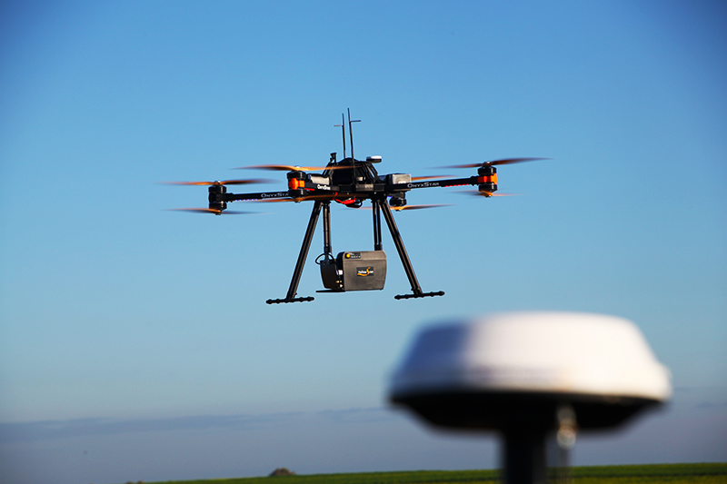

background-image: url("./assets/img/bg_01.jpg")
background-size: cover

```{r setup, include=FALSE}
options(htmltools.dir.version = FALSE, htmltools.preserve.raw = FALSE)
```


```{r xaringan-all, echo=FALSE, include=FALSE}
library(countdown)
library(xaringan)
library(xaringanExtra)
library(knitr)

hook_source <- knitr::knit_hooks$get('source')
knitr::knit_hooks$set(source = function(x, options) {
  x <- stringr::str_replace(x, "^[[:blank:]]?([^*].+?)[[:blank:]]*#<<[[:blank:]]*$", "*\\1")
  hook_source(x, options)
})

xaringanExtra::use_broadcast()
xaringanExtra::use_freezeframe()
xaringanExtra::use_scribble()
xaringanExtra::use_search(show_icon = TRUE, auto_search	=FALSE)
xaringanExtra::use_freezeframe()
xaringanExtra::use_clipboard()
xaringanExtra::use_tile_view()
xaringanExtra::use_panelset()
xaringanExtra::use_editable(expires = 1)
xaringanExtra::use_fit_screen()
xaringanExtra::use_extra_styles(
  hover_code_line = TRUE,         
  mute_unhighlighted_code = TRUE  
)

```


# Introduction to Point Cloud Sensors (PCS)


.panelset[
.panel[.panel-name[**Overview**]
  - PCS excels in creating detailed point cloud data quickly and efficiently, offering customizable settings tailored for speed.
  
  - PCS captures the environment from its viewpoint ( [gloria_iris, 2020](https://blog.csdn.net/gloria_iris/article/details/105720798) ) through a method known as angular sampling, producing point cloud data for each direction sampled.
]
.panel[.panel-name[**LiDAR**]

.pull-left[
  - Lidar ( [Wandinger, 2005](http://superlidar.colorado.edu/Classes/Lidar2008/ReadingMaterials/IntroLidar.pdf) ) is a kind of PCS technology that measures distances by shining a laser on a target and timing how long it takes for the light to bounce back. It can be set to point in one direction or move around to scan an area, which is called lidar scanning or 3D laser scanning. This versatile method is used on the ground, in the air, and on moving platforms. 
]
  
.pull-right[
  ```{r  echo=FALSE, out.width='80%', fig.align='center'}
  
  ```
]
]

.panel[.panel-name[**Importance in modern technology**]
- **How It Works**: LiDAR emits laser beams towards the target. Some of these beams bounce back and are detected by the sensor, measuring the time taken to return.

- **Data Collection**: This time-of-flight information is converted into distance measurements, creating three-dimensional information about the shape and surface characteristics of the target.

- **Advantages**: Offers precise data with high accuracy, works in various conditions including night and through some obstructions like vegetation.

- **Types of LiDAR**: Includes airborne (helicopters, drones) and terrestrial (ground-based) systems, each suited for different applications.

Source: [Wandinger, 2005](http://superlidar.colorado.edu/Classes/Lidar2008/ReadingMaterials/IntroLidar.pdf)
]
]

---

# Applications in Research and Industry

### Autonomous Vehicles

- LiDAR sensors are crucial for automated cars, providing range and intensity information to detect and recognize objects like pedestrians and other vehicles.

- Enhancements in LiDAR resolution have significantly improved, yet challenges remain under adverse weather conditions.

### Weather Condition Analysis

- Studies have investigated LiDAR's performance in various weather conditions, including fog, rain, and snow, indicating performance degradation under such conditions.

- Validation methods include mathematical models, simulations, and indoor fog chamber tests, emphasizing the need for robust sensor performance in all driving scenarios.

Source: [Wandinger, 2005](http://superlidar.colorado.edu/Classes/Lidar2008/ReadingMaterials/IntroLidar.pdf)
---

# PCS in Adverse Weather Conditions

##  Performance Testing

- The study specifically focuses on testing and validating the performance of automotive point-cloud sensors (e.g., LiDAR) in adverse weather conditions like fog and snow.

- Indoor and outdoor tests reveal that all tested sensors' performance degrades under such conditions, yet this is essential for advancing automated driving technologies.

## Automated Driving Challenges

- The research aims to overcome obstacles for automated driving in adverse conditions, such as detecting objects on the road and maintaining environmental awareness, by understanding sensor limits and improving their reliability.

Source: [Jokela et al., 2019](https://www.mdpi.com/2076-3417/9/11/2341/pdf)
---

# Reflection I

- Understanding of Point Cloud Sensors/LiDAR:
    
  - The first time getting close to lidar is my final year of undergraduate studies which needed to improve the pathfinding algorithm of a car with remote control. Throughout this period, I've become quite familiar with how PCS and LiDAR operate, especially their capability to generate high-resolution 3D maps of the environment (If I can have one equipment of myself).

- Challenges 

  - The studies highlighted the challenges faced by these sensors under adverse weather conditions, such as fog, rain, and snow. Imagining the sensor is covered but dirt or snow, it really hard to leave the sensor alone working in some bad weather (expansive prices, battery and so on, oh my gosh).
---

# Reflection II

- Future potential

  - Based on current limitation and application, it may not be the best choice for auto-driving system comparing to directly visual direction making algorithm. However, it has vast potential in areas like disaster management, where accurate 3D mapping can aid in quicker response and recovery efforts like helping quick recover the road/buildings and locate Vulnerable parts of a building that are about collapse.
  
  - The integration of LiDAR data with other technologies, such as radar and cameras, for enhanced object detection and environmental awareness, has the value of an interdisciplinary approach to solving complex problems in sensor technology and data analysis.

  - I've realized the importance of multidisciplinary collaboration in advancing sensor technology. It is great to bring different fields together and achieve a hard task.
---
# References

```{r, load_refs, echo=FALSE, warning=FALSE}
library(RefManageR)
bib <- ReadBib("./pre.bib", check = FALSE)
ui <- "- "
```

```{r, print_refs, results='asis', echo=FALSE, warning=FALSE, message=FALSE}
writeLines(ui)
print(bib[key = "jokela2019testing"], 
  .opts = list(check.entries = FALSE, 
               style = "html", 
               bib.style = "authoryear"))
writeLines(ui)
print(bib[key = "Iris2020"], 
  .opts = list(check.entries = FALSE, 
               style = "html", 
               bib.style = "authoryear"))
writeLines(ui)
print(bib[key = "wandinger2005introduction"], 
  .opts = list(check.entries = FALSE, 
               style = "html", 
               bib.style = "authoryear"))
```

---

class: center, middle

# Thanks!

Slides created via the R package [**xaringan**](https://github.com/yihui/xaringan).

The chakra comes from [remark.js](https://remarkjs.com), [**knitr**](https://yihui.org/knitr/), and [R Markdown](https://rmarkdown.rstudio.com).
